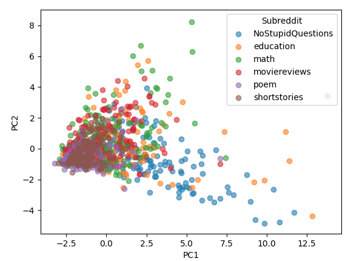

<!--
	***
	*   README.md
	*
	*	Author: Jeong Hoon (Sian) Choi
	*	License: MIT
	*
	***
-->

 

	<h3 align="center">Embedding Comparison</h3>	
	 
	<a href="https://github.com/csian98/embedding-comparison">
		<strong>Explore the docs »</strong>
	</a>
 
 
<a href="https://github.com/csian98/embedding-comparison/issues/new?labels=bug&template=bug-report---.md">Report Bug</a>
·
<a href="https://github.com/csian98/embedding-comparison/issues/new?labels=enhancement&template=feature-request---.md">Request Feature</a>

## About Project

Compared and analyzed the performance of the Documentation Embedding method on 5,000 text data scrapped from Reddit.
We collected data from the Education, Math, MovieReviews, Poem, ShortStories, and NoStupidQuestions subreddits, 
and compared and analyzed the performance of pre-trained Doc2Vec and Document Embedding using Word2Vec + Bag of Words (BoW).

### Doc2Vec

### Word2Vec + BoW

Word2Vec, announced by Google in 2013, can be used to learn embedded vectors that encapsulate the syntax of words 
from given sentence data.
This can be accomplished using either the Continuous Bag Of Words (CBOW) or the Continuously Sliding Skip-Gram method.
We used the Skip-Gram method to generate vector embeddings for all words, and then clustered these vectors to label 
words with similar context as a single group.
Then, we used the Bag of Words (BoW) method to embed each document into a vector for each labeld group.

## 🔐 License

Copyright © 2026, All rights reserved Distributed under the MIT License.
See `LICENSE` for more information.

(<a href="#readme-top">back to top</a>)

